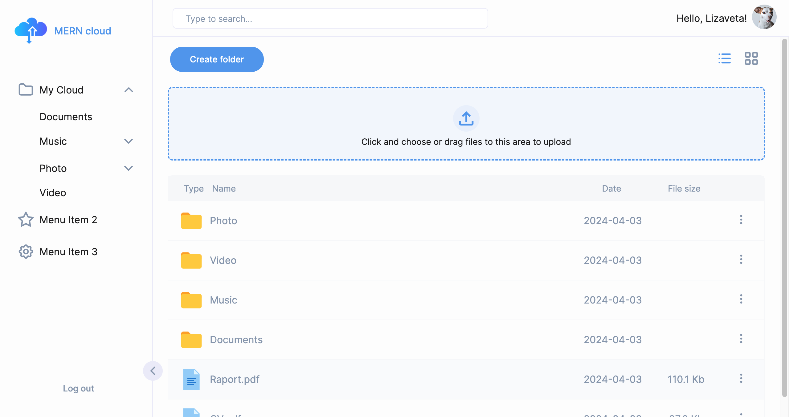
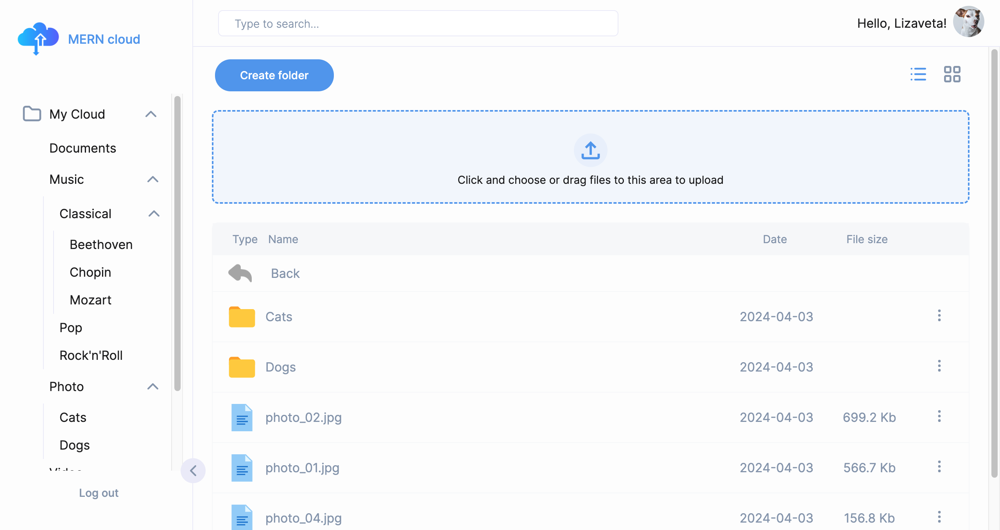
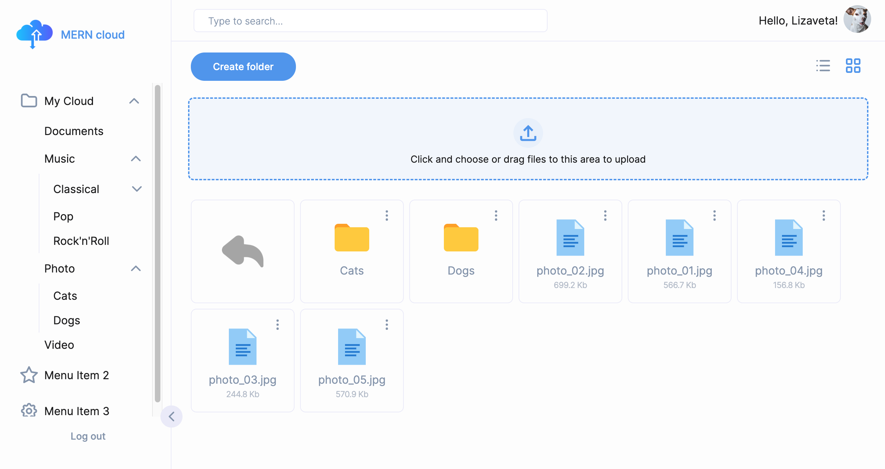
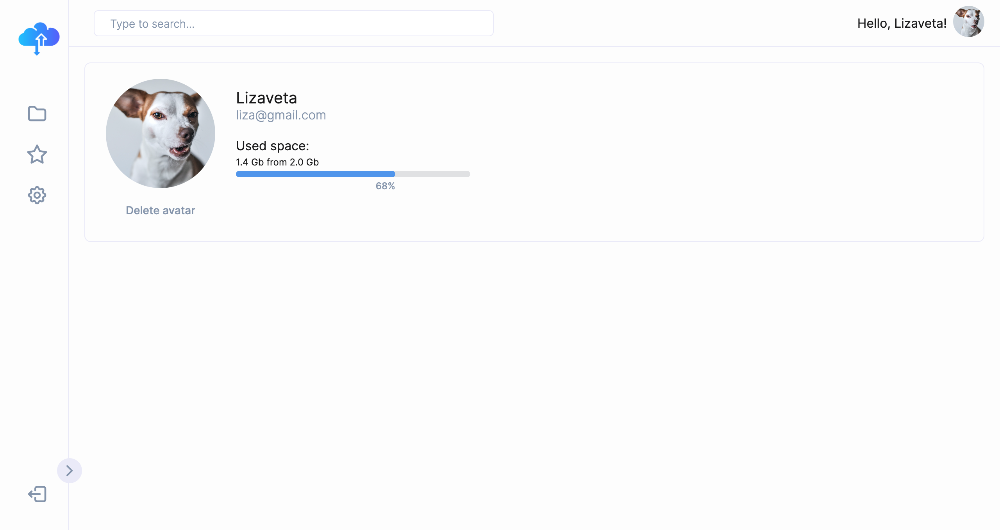

# MERN Stack Cloud Storage

This is a cloud storage application built using the MERN stack (MongoDB, Express.js, React.js, Node.js). It allows users to securely store and manage their files in the cloud.

## Features

- User Authentication: Users can sign up, log in, and log out securely.
- File Upload: Users can upload files to the cloud storage.
- File Management: Users can view, download, and delete their files.
- Search Functionality: Users can search for files by name or type.

## Technologies Used

- MongoDB: A NoSQL database used to store user data and file metadata.
- Express.js: A Node.js framework used for building the backend RESTful API.
- React.js: A JavaScript library used for building the frontend user interface.
- Node.js: A JavaScript runtime environment used for running the backend server.
- JSON Web Tokens (JWT): Used for user authentication and authorization.
- Axios: A promise-based HTTP client for making API requests.

## Screensots
# Main page

# Different views 
 

# Profile page
